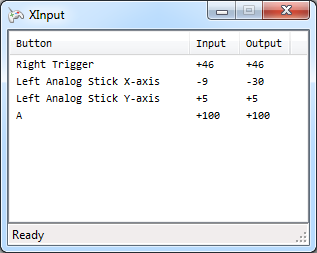

CronusMAX-XInput
====================

XInput support enables you to seamlessly use controllers plugged in to your PC to play games. It captures the input from your PC, converts these inputs and, through the CronusMAX device, sends your commands to the console. This can be particularly useful when a controller is not yet supported by the CronusMAX device directly.

Supported input standards:  
- XInput
- DirectInput via [x360ce](https://code.google.com/p/x360ce/wiki/Whatisx360ceandhowuseIt)

Usage examples:  
- Cross-Over Gaming on PS4
- Controller on Xbox 360 / Xbox One, without switching cables
- PC compatible Gamepads (including via USB adapters)
- PC compatible Joysticks
- PC compatible Steering wheels

Every input used is available on Xbox 360, Xbox One, PS3 and PS4.

Rumble is passed to the controller connected to the PC.

Instructions
------------
1\. [Download the latest release](https://github.com/badgio/CronusMAX-XInput/releases)  
2\. Place `XInput.exe`, `XInput.dll`, `XInput.cfg`, `XInput.gpc` and `gpci.dll` into `C:\Program Files (x86)\Gtuner` * 
___

If you need to use [x360ce (Xbox 360 Controller Emulator)](https://code.google.com/p/x360ce/wiki/Whatisx360ceandhowuseIt)  
3\. Place `x360ce.exe` in `C:\Program Files (x86)\Gtuner` and run.  
4\. Allow it to create `x360ce.ini` and `xinput1_3.dll`, configure if needed, then close x360ce.  
___

 5\. Run `XInput.exe` or load the plugin from the Plugins menu in Gtuner.

When both controller and device are detected XInput forwarding will begin automatically.

To use a GPC script with XInput amend `XInput.gpc`. This script is loaded when XInput is launched.

\* If you are running a 32-bit version of Windows the path will be `C:\Program Files\Gtuner`


